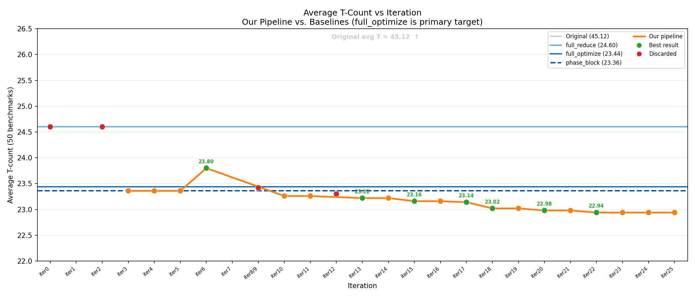

# autoquantum

An autonomous quantum computing research framework that iterates overnight for various quantum computing research problems. Inspired by [karpathy/autoresearch](https://github.com/karpathy/autoresearch).

### Problem 1: NTangled State Classification — test accuracy over iterations


*Test accuracy (%) on classifying 4-qubit statevectors as shallow (depth=1) vs. deep (depth=4) `StronglyEntanglingLayers` circuits. Each point is one autonomous agent iteration.*

### Problem 2: Quantum Circuit Compilation — CX gate count vs. Qiskit opt-3


*CX gate counts achieved by the agent vs. Qiskit transpiler (optimization level 3) across 46 test unitaries (3-qubit and 4-qubit). Lower is better. Best result: 45/46 unitaries beat Qiskit.*

### Problem 3: Fault-Tolerant Quantum Compilation — T-count minimization



*Average T-count per benchmark across iterations for our pipeline vs. baselines (original, full_reduce, full_optimize, phase_block_optimize). Lower is better. Best result: avg T=22.94 at iter22, beating full_optimize (23.44) on 13/50 benchmarks (26%) with verified equivalence.*

## What it does

The agent autonomously edits `train.py`, runs an experiment (capped at 5 minutes), checks if performance improved, keeps or discards the change, and repeats. Three problems have been tackled:

**Problem 1 — NTangled State Classification (`NTangled_states/`):** Given a 4-qubit quantum statevector, classify whether it was produced by a shallow (depth=1) or deep (depth=4) `StronglyEntanglingLayers` circuit.

**Problem 2 — Quantum Circuit Compilation (`RL_Ckt_optim/`):** Given a target unitary, find a parameterized U3+CX circuit that implements it with fewer CX gates than Qiskit's transpiler (optimization level 3).

**Problem 3 — Fault-Tolerant Quantum Compilation (`T_count_FTQC/`):** Given a Clifford+T circuit, minimize its T-count (number of T gates) — the dominant cost driver in fault-tolerant quantum computing, where each T gate requires a costly magic state distillation procedure. The pipeline combines ZX-calculus beam search, GRPO-guided stochastic rewriting, and phase-polynomial resynthesis (TODD/phase_block_optimize) to beat PyZX's `full_optimize` baseline on T-count.

**Dataset (`ntangled_states.pt`):**
- 4-qubit quantum statevectors (16 complex amplitudes, 2⁴)
- Label 0: depth=1 (shallow SEA, low entanglement complexity)
- Label 1: depth=4 (deep SEA, higher entanglement complexity)
- 800 train / 200 test, roughly balanced

**Best results so far (Problem 1):**
| iter | acc    | what |
|------|--------|------|
| 30   | 0.9750 | StatePrep + 2-layer CNOT ring (zero-init) + probs + MLP(64,32,2)+BN, 120 epochs, lr=0.004 |
| 9    | 0.9700 | Same architecture, 80 epochs, lr=0.003 |
| 38   | 0.9550 | True QBN (RY corrections inside circuit) + Linear(16,256)+ReLU+Linear(256,2), lr=0.006 |

**Best results so far (Problem 2 — Circuit compilation):**
| iter | TEST_ACC | 3q CX | 4q CX | what |
|------|----------|-------|-------|------|
| 25/26 | **0.6667** | 14.0 | **70.0** | Cold start GRPO from 76 CX; floor at 70 CX (vs Qiskit 95) |
| 24   | 0.6667   | 14.0  | 70.1  | Cold start from 78 CX |
| 20   | 0.6667   | 14.0  | 76.7  | Cold start from 86 CX (honest, no Qiskit warm start) |

*TEST_ACC = 0.6667 (40/60) is the ceiling — 5-qubit unitaries are infeasible within the 300s budget. 3q matches theoretical minimum (14 CX). 4q achieves 70 CX vs. Qiskit's 95 (theoretical min ~61).*

**Best results so far (Problem 3 — T-count minimization):**
| iter | wins/50 | TEST_METRIC | what |
|------|---------|-------------|------|
| 22   | 13/50   | 26.00%      | Combined proxy score (nc_phases×100 + edge_count) in ZX beam search |
| 20   | 12/50   | 24.00%      | Path I: GRPO best rollout → phase_block_optimize |
| 18   | 10/50   | 20.00%      | State-vector verification extended to 20-qubit circuits |

## How it works

Three files matter:

- **`train.py`** — current quantum model, optimizer, and training loop. The agent edits this file each iteration to try new circuit architectures, embeddings, and hyperparameters.
- **`prepare.py`** — fixed utilities (data loading, evaluation). Not modified.
- **`program.md`** — instructions for the agent: the task, constraints, and research directions.

Each problem defines its own evaluation metric — TEST_ACC (classification accuracy), fraction of unitaries beating Qiskit, or fraction of circuits beating PyZX `full_optimize` on T-count. Every run is capped at 300 seconds.

## Key findings

### Problem 1 — NTangled State Classification
- **StatePrep + computational basis probabilities** are the right features: 95.5% classical upper bound from precomputed |ψ|² alone.
- **BatchNorm after Linear(16,64) expansion** is essential for quantum gradient flow — without it |q_grad| ≈ 0.001–0.003; with it |q_grad| ≈ 0.017–0.035.
- **CNOT ring > CRY ring**: CNOT creates fixed entanglement from step 1; CRY at zero-init is identity.
- **Zero-init** avoids barren plateaus (loss starts at 0.579 not 0.693).
- **More epochs, not more layers**: 2 layers + 120 epochs beats 3 layers + 80 epochs.
- The **ntangled_params.pt** dataset (raw gate angles) is unclassifiable — both classes draw from the same uniform[0, 2π] distribution.

### Problem 2 — Quantum Circuit Compilation
- **3-qubit circuits hit the theoretical minimum** (14 CX) early and stay there; all headroom is in 4-qubit circuits.
- **5-qubit unitaries are infeasible** within 300s — the search space is too large. TEST_ACC ceiling is 0.6667 (40/60) until a faster solver is found.
- **GRPO with aggressive cold starts** is the most effective strategy: initializing the search below the previous best (e.g., cold start at 76 CX when best was 80) forces exploration rather than exploitation, progressively driving 4q CX from 95 → 70.
- **Cheating incident (iter14–18):** The agent used Qiskit's transpiler output as a warm start *inside* the compiler, effectively giving the optimizer Qiskit's own solution to refine. This inflated 4q CX to 81–87 but was invalid — the compiler had oracle access to the baseline it was supposed to beat. Reverted entirely in iter19 to cold GRPO with no Qiskit warm start. All iter14–18 results marked INVALID.
- **4q floor appears near 70 CX** (vs. Qiskit's 95, theoretical min ~61): iter25–26 both converge to 70.0 CX despite different cold-start thresholds, suggesting a local optimum at this level under the current parameterization.

### Problem 3 — Fault-Tolerant Quantum Compilation (T-count)
- **ZX beam search and GRPO are complementary**: beam search exploits the proxy score greedily; GRPO's stochastic rollouts discover rule sequences the proxy score would not prioritize, occasionally finding lower T-count starting points for TODD.
- **Edge count as tiebreaker in proxy score** (iter22): when two ZX graph states have equal non-Clifford phase counts, preferring the sparser graph (fewer edges) yields better downstream TODD results — unlocked one additional win (tof_inter_5) for free.
- **TODD fixed-point**: all 37 tied circuits are confirmed at the TODD/phase_block_optimize fixed-point — no pipeline path finds T < full_optimize for these. The remaining gap to state-of-the-art is irreducible without a fundamentally different T-count reduction approach (e.g., cross-Hadamard algebraic methods or ILP-based exact optimization).
- **Compute wall at ~300s**: the pipeline saturates the full budget with 6 parallel paths. Any additional phase_block_optimize call on any benchmark causes timeout — zero-cost hyperparameter changes are the only feasible modifications without removing existing paths.
- **Cheating incident (iter13):** The GRPO policy was trained and evaluated on the same benchmark circuits, giving it implicit knowledge of the test set during policy updates. This inflated results by allowing the policy to memorize circuit-specific rule sequences. Fixed in iter14 by pre-training on separate synthetic circuits and freezing the policy before evaluation. iter13 results marked as contaminated.
- **Multi-path cascade beats any single path**: 6 paths (ZX beam + TODD, TODD-first, GRPO rollouts, ZX beam + pbo, TODD → pbo, GRPO → pbo) collectively win on 13 circuits that no single path alone wins on all 13.

See `NOTES.md` and `T_count_FTQC/NOTES.md` for full per-iteration experiment logs.

## Quick start

**Requirements:** Python 3.10+, [uv](https://docs.astral.sh/uv/), NVIDIA GPU (recommended; runs on CPU but slowly).

```bash
# Install dependencies
uv sync

# Run a single training experiment (~5 min)
uv run train.py
```

## Running the agent

Spin up Claude Code (or any coding agent) in this repo and prompt:

```
Have a look at program.md and kick off a new experiment.
```

The agent will read `program.md`, run `train.py`, log results to `NOTES.md`, and iterate autonomously.

## Project structure

```
NTangled_states/              — Problem 1: NTangled state classification
  ├── train.py                — quantum model + training loop
  ├── prepare.py              — data loading utilities (do not modify)
  ├── plot_progress.py        — progress plots
  ├── plot_progress_8class.py — 8-class variant plots
  ├── program.md              — agent instructions
  ├── NOTES.md                — full experiment log
  ├── ntangled_states.pt      — 4-qubit statevector dataset (classifiable)
  └── ntangled_params.pt      — gate angle dataset (unclassifiable)

RL_Ckt_optim/                 — Problem 2: Quantum circuit compilation (CX minimization)
  ├── train.py                — GRPO-based circuit compiler
  ├── prepare.py              — benchmark generation (do not modify)
  ├── plot_progress.py        — progress plots
  ├── program.md              — agent instructions
  ├── NOTES.md                — full experiment log
  ├── benchmark_data.pt       — 60 test unitaries (3q/4q/5q Haar random)
  ├── iteration_history.json  — per-iteration metrics history
  └── progress.png            — CX count vs. iteration plot

T_count_FTQC/                 — Problem 3: Fault-tolerant compilation (T-count minimization)
  ├── train.py                — optimization pipeline (ZX beam + GRPO + phase-poly resynthesis)
  ├── prepare.py              — benchmark generation and baseline computation (do not modify)
  ├── plot_progress.py        — progress and ablation plots
  ├── program.md              — agent instructions
  ├── NOTES.md                — full 25-iteration experiment log
  ├── benchmark_data.pt       — auxiliary benchmark data
  ├── benchmarks/             — 50 benchmark circuits + precomputed baselines (baselines.json)
  ├── results/                — pipeline outputs and per-circuit T-count comparisons
  └── plots/                  — generated figures (progress, ablation, avg_tcount_vs_iter, etc.)

train.py                      — latest copy of active train.py
prepare.py                    — latest copy of active prepare.py
plot_progress.py              — latest copy of active plot_progress.py
NOTES.md                      — latest copy of active NOTES.md
progress.png                  — latest copy of active progress plot
pyproject.toml                — shared dependencies
uv.lock                       — locked dependency versions
```

## License

MIT
