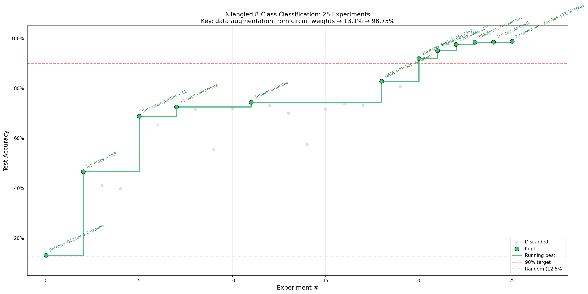
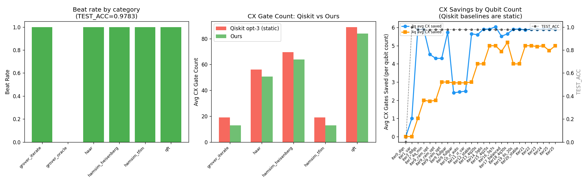

# autoquantum

An autonomous quantum computing research framework that iterates overnight for various quantum computing research problems. Inspired by [karpathy/autoresearch](https://github.com/karpathy/autoresearch).

### Problem 1: NTangled State Classification — test accuracy over iterations



*Test accuracy (%) on classifying 4-qubit statevectors as shallow (depth=1) vs. deep (depth=4) `StronglyEntanglingLayers` circuits. Each point is one autonomous agent iteration.*

### Problem 2: Quantum Circuit Compilation — CX gate count vs. Qiskit opt-3



*CX gate counts achieved by the agent vs. Qiskit transpiler (optimization level 3) across 46 test unitaries (3-qubit and 4-qubit). Lower is better. Best result: 45/46 unitaries beat Qiskit.*

## What it does

The agent autonomously edits `train.py`, runs an experiment (capped at 5 minutes), checks if performance improved, keeps or discards the change, and repeats. Two problems have been tackled:

**Problem 1 — NTangled State Classification:** Given a 4-qubit quantum statevector, classify whether it was produced by a shallow (depth=1) or deep (depth=4) `StronglyEntanglingLayers` circuit.

**Problem 2 — Quantum Circuit Compilation (`RL_Ckt_optim/`):** Given a target unitary, find a parameterized U3+CX circuit that implements it with fewer CX gates than Qiskit's transpiler (optimization level 3).

**Dataset (`ntangled_states.pt`):**
- 4-qubit quantum statevectors (16 complex amplitudes, 2⁴)
- Label 0: depth=1 (shallow SEA, low entanglement complexity)
- Label 1: depth=4 (deep SEA, higher entanglement complexity)
- 800 train / 200 test, roughly balanced

**Best results so far:**
| iter | acc    | what |
|------|--------|------|
| 30   | 0.9750 | StatePrep + 2-layer CNOT ring (zero-init) + probs + MLP(64,32,2)+BN, 120 epochs, lr=0.004 |
| 9    | 0.9700 | Same architecture, 80 epochs, lr=0.003 |
| 38   | 0.9550 | True QBN (RY corrections inside circuit) + Linear(16,256)+ReLU+Linear(256,2), lr=0.006 |

## How it works

Three files matter:

- **`train.py`** — current quantum model, optimizer, and training loop. The agent edits this file each iteration to try new circuit architectures, embeddings, and hyperparameters.
- **`prepare.py`** — fixed utilities (data loading, evaluation). Not modified.
- **`program.md`** — instructions for the agent: the task, constraints, and research directions.

The training metric is **TEST_ACC** on the held-out 200 statevectors. Each run is capped at 300 seconds.

## Key findings

- **StatePrep + computational basis probabilities** are the right features: 95.5% classical upper bound from precomputed |ψ|² alone.
- **BatchNorm after Linear(16,64) expansion** is essential for quantum gradient flow — without it |q_grad| ≈ 0.001–0.003; with it |q_grad| ≈ 0.017–0.035.
- **CNOT ring > CRY ring**: CNOT creates fixed entanglement from step 1; CRY at zero-init is identity.
- **Zero-init** avoids barren plateaus (loss starts at 0.579 not 0.693).
- **More epochs, not more layers**: 2 layers + 120 epochs beats 3 layers + 80 epochs.
- The **ntangled_params.pt** dataset (raw gate angles) is unclassifiable — both classes draw from the same uniform[0, 2π] distribution.

See `NOTES.md` for the full 38-iteration experiment log with mechanistic analysis.

## Quick start

**Requirements:** Python 3.10+, [uv](https://docs.astral.sh/uv/), NVIDIA GPU (recommended; runs on CPU but slowly).

```bash
# Install dependencies
uv sync

# Run a single training experiment (~5 min)
uv run train.py
```

## Running the agent

Spin up Claude Code (or any coding agent) in this repo and prompt:

```
Have a look at program.md and kick off a new experiment.
```

The agent will read `program.md`, run `train.py`, log results to `NOTES.md`, and iterate autonomously.

## Project structure

```
train.py        — quantum model, optimizer, training loop (agent modifies this)
prepare.py      — data loading + evaluation utilities (do not modify)
program.md      — agent instructions and research directions
NOTES.md        — full experiment log with results and mechanistic analysis
ntangled_states.pt  — 4-qubit statevector dataset (classifiable)
ntangled_params.pt  — gate angle dataset (unclassifiable — both classes same distribution)
pyproject.toml  — dependencies
```

## License

MIT
